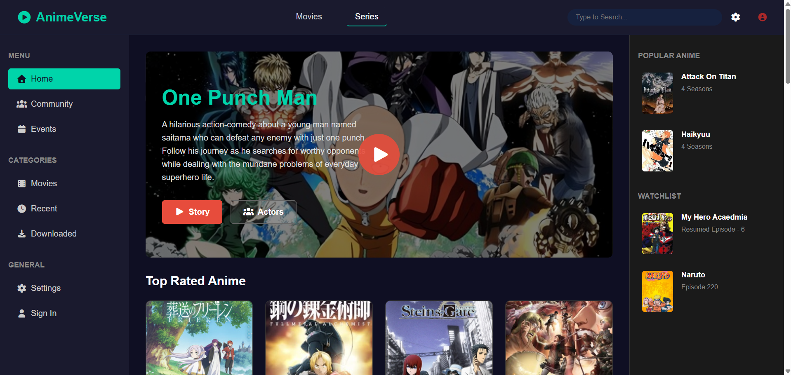

# 🎥 AnimeVerse – Anime Streaming Landing Page  

AnimeVerse is a sleek and modern **anime streaming landing page** built using **HTML, CSS, and JavaScript**.  
It showcases popular anime, top-rated series, and a featured anime section with a clean UI. The anime data for the cards is fetched dynamically from an **anime API**, making the page interactive and closer to a real streaming platform.  


## 🔗 Live Demo  
👉 [View AnimeVerse Live](https://anime-verse-diwaker.netlify.app/)  

# 📷 Screenshots  

### 🎬 Landing Page (Hero Section)  
 

## ✨ Features  
- 🎬 **Featured Anime Section** – Highlighting popular titles like *One Punch Man*.  
- 📂 **Sidebar Navigation** – Easy access to Home, Community, Events, Movies, Recent, Downloaded.  
- ⭐ **Popular Anime List** – Displays trending anime.  
- 📺 **Watchlist Section** – Resume episodes or track favorites.  
- 🏆 **Top Rated Anime Cards** – Dynamically fetched data from API.  
- 🎨 **Responsive UI** – Clean, modern design with layout flexibility.  


## 🛠️ Tech Stack  
- **HTML5**  
- **CSS3**  
- **JavaScript (ES6+)**  
- **Anime API Integration**  


## 🚀 How to Run Locally  
1. Clone the repo:  
   ```bash
   git clone https://github.com/your-username/AnimeVerse.git
